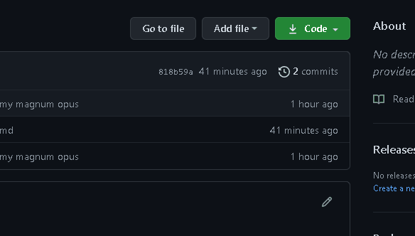

# **Bookflix**


> **Status:** Em desenvolvimento
## Descrição:

 Clone da interface da Netflix focado no acervo de livros para leitura utilizando Javascript, HTML e CSS.

 > Um projeto elaborado com base nass aulas da [Digital Innovation One](https://digitalinnovation.one/)

 ## Tecnologias utilizadas:

 - CSS para estilização
 - [Owl carousel](https://owlcarousel2.github.io/OwlCarousel2/) (plug-in JQuery) para dipôr os cards com efeito de carrossel e de forma responsiva
 - Javascript para lógica de programação


## Rodando em seu computador:

- Poderá fazer o download do arquivo como mostra abaixo:



- Ou também clonar o repositório no [Git](https://git-scm.com/) com o seguinte comando:

```bash
$git clone https://github.com/Eric-Gabriel-Larroque/Bookflix.git
```
## A Fazer:

- Resolver o evento onlick do botão 'mais informações'
- Automatizar a disposição das tags de acordo com sua classificação
